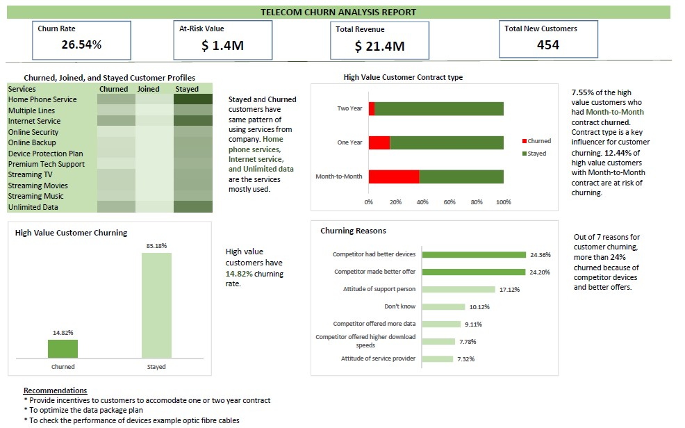

# Customer Churn Analysis
Help a fictional Telecommunications company to improve retention by analyzing their CRM data to identify high-value customers and churn risks. The company provides phone and internet services to 7,043 customers in California, and includes details about customer demographics, location, services, and current status. You'll be assuming the role of a BI Consultant for Maven Communications, a California-based Telecommunications company.
## Challenge Objective
You've been hired to help the company improve retention by identifying high value customers and churn risks, and have been asked to present your findings to the CMO in the form of a single page report or dashboard.
## Data Dictionary

## Data cleaning

**a) Handling Missing Values**
* Average monthly long distance charges - 682 blanks
* Multiple lines - 682 blanks
* Internet type - 1526 blanks
* Average monthly GB download - 1526
* Online security - 1526
* Online backup - 1526
* Device protection plan - 1526
* Premium Tech Support - 1526
* Streaming TV - 1526
* Streaming Movies - 1526
* Streaming Music - 1526
* Unlimited Data - 1526
* Churn Category - 5174
* Churn Reason - 5174

The dictionary provided values for handling blanks. Missing values for churn category and churn reason were left as they are because the stayed and joined customers had yet no reason to churn

**b) Data value error**

Monthly charge variable had 120 negative values instead of positive. Used Find and Replace feature to find negative sign and replace it with blank

## EDA
**a) Univariate analysis**

 
Many customers churned because of the advantage the competitor has on devices and offers
 
 

 
The churn rate of customers in last quater is 26.54%
 
 
Each variable was filtered with churned and stayed status to compare which variable has more effect to customer status (churned and stayed)
 
 

 
Customers who churned many of them are not married while who stayed are married. Marriage status affects customer churning
 
 

 
Fibre Optic internet type is the most prefered internet type
 
 

 
Customers who churned many of them have Month-to-month contract type while stayed customers have one or two years contract type. Contract type affects customer churning
 
 	

 
Paperless billing is the most prefered billing
 
 

 
Bank withdrawl is the payment method mostly prefered
 
 
**b) Bivariate analysis**

Correlation between Tenure and total revenue
 

 
There is positive correlation. A customer with large tenure is likely to spend more to the services
 
 

**c) Binary variables**

11 binary variables were created replacing Yes/No categories with with 1/0 values respectively. The reason is to quantify the services to see which services provided by the company were mostly used by stayed, churned and joined customers. 11 variables were encoded and summarized using pivot table. Extracted data from pivot table, transposed then conditional formatted the data
 

 
Home phone service, internet service, and unlimited data are the services mostly used by churned and stayed customers
 
 

**Conclusion**

Factors influencing customer churning are;
* Marriage
* Contract type which has high impact to churning

### High Value Customers Analysis
* High value customers at risk
* At-Risk Value
* High value customers churning rate
  
**Customer Segmentation**

Segmented customers as high, medium, and low value customer according to the amount they contribute to company revenue
Created 3 quartiles; Q1 = Low, Q2 = medium and Q3 = high

``=IF(AI2>QUARTILE.INC($AI$2:$AI$7044,3),"High",IF(AI2>QUARTILE.INC($AI$2:$AI$7044,1),"Medium","Low"))``

## Report

## Recommendations
* The company should provide incentives to customers to accomodate one or two year contract
* Optimize the data package plan
* To check the performance of devices example fibre optic cables

